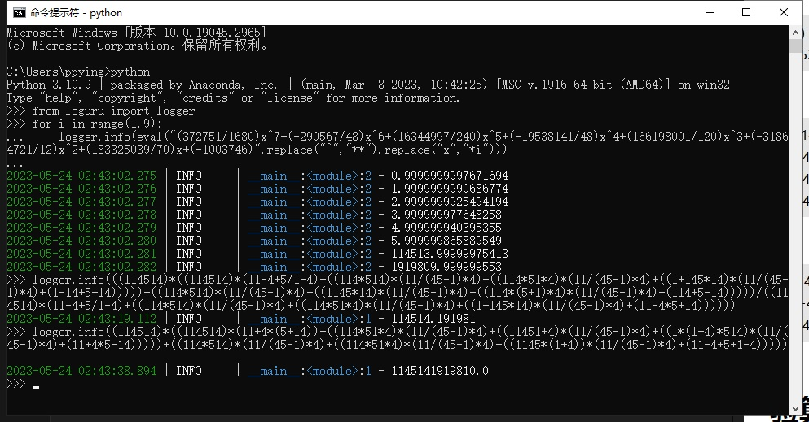

# homo数学家

    任何实数都用连续的114514通过加减乘除达成, 任给一组数据都能找出其内在规律(函数表达式)

# 安装
    
    nb plugin install nonebot_plugin_homo_mathematician

# 命令头:

    命令头: {lag, 找规律}  / {homonumber, 臭数字}  eg: 找规律 1 2 3 4 5 6 7 114514 1919810  / homonumber 2749903559

# 效果

# 验算

